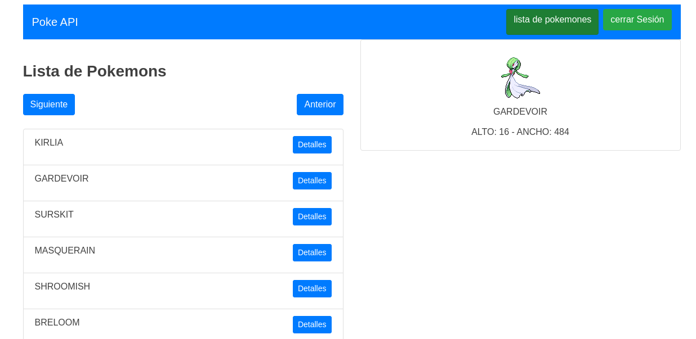

<h1 style="text-align: center;">Sistema para ver una lista de pokemones</h1>

Se trata de un pequeño sistema para ver una lista de pokemones, que se realiazo con la finalidad de poner en practica los siguientes conocimientos.

<ul>
	<li>React</li>
	<li>Redux</li>
	<li>React-router</li>
	<li>Firebase</li>
</ul>